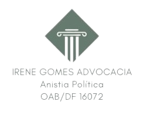
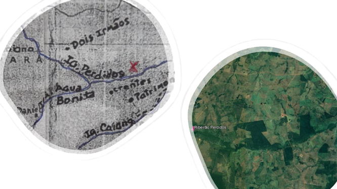
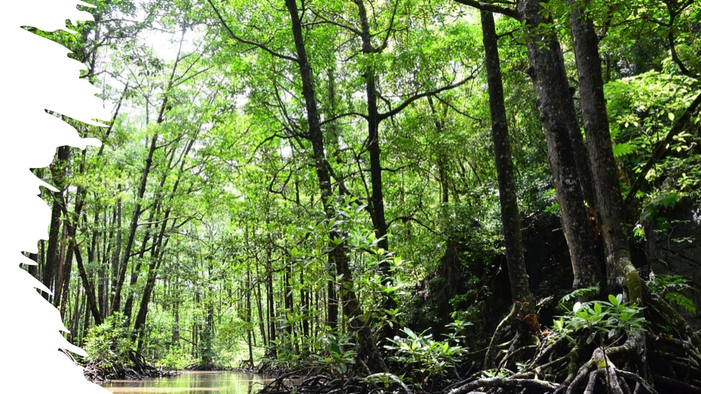
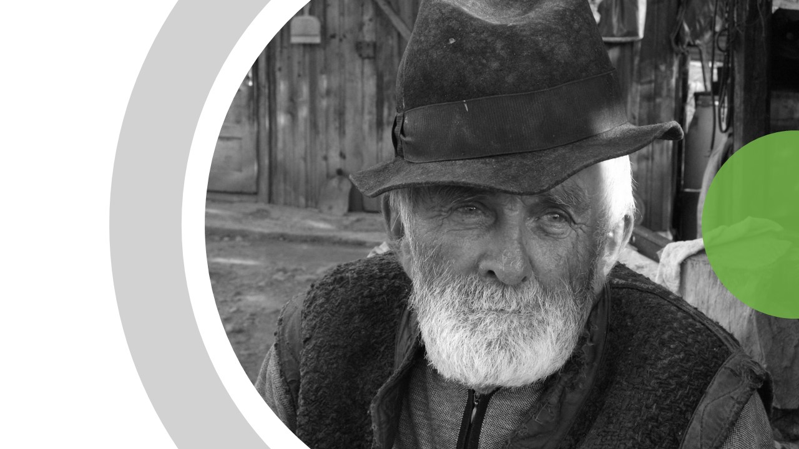

```{r setup, include=FALSE}
library(flexdashboard)
```

```{r libraries, warning = FALSE, message = FALSE}

library(tidyverse)
library(data.table)
library(descr)
library(RColorBrewer)
library(hrbrthemes)
library(kableExtra)
library(knitr)
library(htmltools)
library(htmlwidgets)
library(DT)
library(leaflet)
library(sf)
library(shiny)
library(plotly)
library(ggthemes)
library(forcats)
library(crosstalk)
#library(summarywidget)
library(rgdal)
library(foreign)
library(sp)
library(stringi)
library(readxl)
library(wordcloud2)
library(dplyr)


options(knitr.table.format = "html")

```

Apresentação
=================

Input {.sidebar}
-----------------------------------------------------------------------

### 

</br>

```{r, echo=FALSE, fig.cap=" ", out.width = '50%', fig.align='center'}


```

<center>

[Relatório completo online]()  

[**Baixar relatório**](https://docs.google.com/document/d/1DyJV5lUKVZ5-hR6dN45TSkqOOZpQ-Mk0/edit?usp=share_link&ouid=103657752665479661258&rtpof=true&sd=true)

</center>

</br>


```{r , echo=FALSE, fig.cap=" ", out.width = '80%', fig.align='center'}



```

</br>

</br>

</br>

</br>

</br>


</br>


</br>
</br>
</br>

<center>

Dúvidas e sugestões:
ireneanistia@gmail.com


</center>


```{r leitura e pré-processamento de dados, include = FALSE}

# Leitura de bases de dados


# Encoding(ameacadas$nome) <- "UTF-8"

```


Column {data-width=400}
-----------------------------------------------------------------------

### **A Batalha dos Perdidos** 

</br>

A Batalha dos Perdidos ocorreu no final do ano de 1976, nas proximidades da região onde se deu a Guerrilha do Araguaia. Pela coincidência da localização e a proximidade da data, as FFAA entenderam tratar-se de uma sequência da Guerrilha do Araguaia, consierando o ato de caráter subversivo atentatório a segurança nacional, dispensando aos camponeses da área o mesmo tratamento dispensado aos envolvidos na guerrilha.  Ocorre que a batalha dos Perdidos tratou-se tão somente de uma disputa de terras travada entre fazendeiros locais, desconhecidos residentes em São Paulo (via ação judicial), INCRA e camponeses posseiros.  

O evento ocorreu em oito localidades distribuídas no atual município de Piçarra (na época parte do território formava o município de Conceição do Araguaia, no estado do Pará. Afetou diretamente cerca de 300 camponeses (70% homens e 30% nulheres), com impactos indiretos alcançando aproximadamente 1.200 pessoas. Alguns efeitos negativos das ações repressivas do estado brasileiro perduram até hoje nos familiares dos envolvidos.

Nesse painel apresentamos uma caracterização geral do evento, de parte dos envolvidos e dos impactos sofridos pelos camponeses a partir de relatos de alguns dos envolvidos.


### **A região dos Perdidos** 

```{r imagem 1,  echo=FALSE, fig.cap=" ", out.width = '70%', fig.align='center'}



```

```{r gráfico G1 - Camponeses por gênero, echo=FALSE}


# ------------------------- Número de pessoas por gênero

# pessoas.genero <- data.frame(
#   genero = c("Homens", "Mulheres"),
#   total = c(100, 150)
# )
# 
# 
# mycolors <- c("#dbead5", "#A2D8A2")
# 
# G1 <- pessoas.genero %>%
#   group_by(genero) %>%
#   summarise(count = n()) %>%
#         plot_ly(labels = ~genero,
#         values = ~count,
#         marker = list(colors = mycolors)) %>%
# add_pie(hole = 0.4) %>%
# layout(xaxis = list(zeroline = F,
#                     showline = F,
#                     showticklabels = F,
#                     showgrid = F),
#        yaxis = list(zeroline = F,
#                     showline = F,
#                     showticklabels=F,
#                     showgrid=F))
# G1

```

Column {data-width=400}
-----------------------------------------------------------------------

### **Região do Igarapé Perdidos** 

```{r imagem 1-A,  echo=FALSE, fig.cap=" ", out.width = '80%', fig.align='center'}



```


### **O camponês** 

```{r imagem 2, echo=FALSE, fig.cap=" ", out.width = '60%', fig.align='center'}



```

Column {data-width=200}
-----------------------------------------------------------------------

### Camponeses diretamente afetados

```{r}

valueBox(260, color = "#982323")
```

### Homens

```{r}

valueBox(135, color = "#006400")
```

### Mulheres

```{r}

valueBox(125, color = "#006400")
```

### Pessoas presas

```{r}

valueBox(75, color = "#982323")
```

### Pessoas direta e indiretamente afetadas


```{r}


valueBox(1200, color = "#982323")
```

### Localidades envolvidas

```{r}

valueBox(10, color = "#E7DE9D")
```

### Município envolvido, em 

```{r}

valueBox(1, color = "#E7DE9D")
```


### Unidade federativa

```{r}

valueBox(1, color = "#E7DE9D")
```


Camponeses afetados
=====================

Column 1 {data-width=500}
-------------------------

### **Lista de camponeses afetados pelos eventos da Batalha dos Perdidos**

```{r tabela camponeses afetados}

lista_camponesesa <-read_csv2("data/Perdidosa.csv")

View(lista_camponesesa)

Tabela_camponesesa <- datatable(lista_camponesesa,
                           caption = 'Tabela 1. Caracterização dos camponeses afetados pelos eventos relacionados à Batalha dos Perdidos.',

                           colnames = c('Nome', 'Idade', 'Esposa', 'Esposo', 'Pai', 'Mãe', 'Filhos', 'Irmãos', 'Localidade', 'Região'),
                          
                           extensions = 'Buttons',
                           elementId = NULL,
                           # extensions= "Scroller",
                           style="bootstrap",
                           class="stripe hover",
                           width="80%",
                           rownames = F,
                           autoHideNavigation = T,
                           escape =FALSE,
                           filter = "top",
                           options=list(deferRender=TRUE,
                                   pageLength = 15,
                                   scrollY=300,
                                   dom = 'Bfrtip', 
                         buttons = c('copy', 'csv', 'excel', 'pdf')))
    
Tabela_camponesesa


```


Vizinhos 
===================

Column 1 {data-width=500}
--------------------------------------------------

### **Vizinhos mais citados**

```{r leitura e pré-processamento de dados - vizinhos, echo=FALSE}

# Leitura da planilha de dados - vizinhos

vizinhos <- read.csv2("data/vizinhos.csv", encoding="Windows-1252")


# Sumarização dos dados - 20 vizinhos mais citados

func_vizinhos <- vizinhos %>%
   count(Vizinhos, sort = TRUE) %>% 
   slice_head(n=20)


# Gráfico G3 - gráfico de barras - 20 vizinhos mais citados  

G3 <- func_vizinhos %>%
        mutate(Vizinhos = fct_reorder(Vizinhos, n)) %>%
        ggplot(aes(x = Vizinhos, y = n, fill = n)) +
        geom_col() +
        coord_flip() +
        labs(x = " ", y = "Vezes em que foi citado")

G3

```

Column 2 {data-width=500}
---------------------------------------------------------

### **Camponeses mais citados como vizinhos** 

```{r vizinhos, echo=FALSE, fig.cap=" ", out.width = '50%', fig.align='center'}

library(wordcloud)

wordcloud(func_vizinhos$Vizinho, func_vizinhos$n, random.order=T, rot.per=0.3, scale=c(2,.01), max.words=40, colors = brewer.pal(8, "Dark2"))

# wordcloud2(func_vizinhos, size = 0.2, minSize = 5, gridSize =  0,
#     fontFamily = 'Segoe UI', fontWeight = 'bold',
#     color = 'random-dark', backgroundColor = "white",
#     minRotation = -pi/4, maxRotation = pi/4, shuffle = TRUE,
#     rotateRatio = 0.4, shape = 'circle', ellipticity = 0.65,
#     widgetsize = NULL, figPath = NULL, hoverFunction = NULL)

# knitr::include_graphics("fig/vizinhos.jpg")

```

Presos
=============================

Column 1 {data-width=500}
---------------------------------------------------------

### **Camponeses mais citados como presos**


```{r presos, fig.cap=" ", out.width = '50%', fig.align='center'}

# Leitura dos dados - presos

presos <- read.csv2("data/presos.csv", encoding="UTF-8")

# Organização dos presos por frequência de citação

func_presos <- presos %>%
  count(Presos, sort = TRUE)

# Elaboração da figura "nuvem de palavras - presos"

library(wordcloud)

wordcloud(func_presos$Presos, func_presos$n, random.order=T, rot.per=0.3, scale=c(2,.01), max.words=40, colors = brewer.pal(8, "Dark2"))


# wordcloud2(func_presos, size = 0.5, minSize = 5, gridSize =  0,
#     fontFamily = 'Segoe UI', fontWeight = 'bold',
#     color = 'random-dark', backgroundColor = "white",
#     minRotation = -pi/4, maxRotation = pi/4, shuffle = TRUE,
#     rotateRatio = 0.4, shape = 'circle', ellipticity = 0.65,
#     widgetsize = NULL, figPath = NULL, hoverFunction = NULL)

```

Column 2 {data-width=500}
-----------------------------------------------------------------------

### **Presos mais citados**

```{r Gráfico G4, echo=FALSE}


# Sumarização dos dados - 20 vizinhos mais citados

func_presos <- presos %>%
   count(Presos, sort = TRUE) %>%
   slice_head(n=20)

# Gráfico G4 - gráfico de barras - 20 presos mais citados 
  
G4 <- func_presos %>%
  mutate(Presos = fct_reorder(Presos, n)) %>%
  ggplot(aes(x = Presos, y = n, fill = n)) +
  geom_col() +
  coord_flip() +
  labs(x = " ", y = "Vezes em que foi citado")

G4

```

Locais dos eventos
===============================

Column {data-width=600}
-----------------------------------------------------------------------

### **Principais locais dos eventos relacionados à Batalha dos Perdidos**


```{r mapa das espécies ameaçadas de extinção}

localidades <- readOGR("data/localidades1.kml", verbose = FALSE)

mapa <- leaflet() %>%
  #Base groups
  setView(lng = -47, lat = -7,
          zoom = 8) %>%
  #addProviderTiles(providers$Esri.WorldImagery, group = "Imagem ESRI") %>%
  addProviderTiles(providers$Stamen.TonerLite, group = "Stamen Toner Lite") %>%
  #addProviderTiles(providers$OpenStreetMap.Mapnik, group = "Open Street Map") %>%

  #Overlay groups
  # addPolygons(data = areas_importantes,
  #             color = "#96390e",
  #             weight = 1,
  #             group = "Área importante para aves") %>%
#   addPolygons(data = riqueza,
#               color = "#3c39db",
#               weight = 1,
#               group = "Riqueza de aves") %>%
# addPolygons(data = concentracao,
#             color = "#006400",
#             weight = 1,
#             group = "Área de concentração de aves") %>%
#             # popup = paste("Área: ", N_concentracao$Nome, "<br>",
#             #               "UF: ", N_concentracao$estado, "<br>",
#             #               "Descrição: ", N_concentracao$Descricao, "<br>",
#             #               "Fonte(s): ", N_concentracao$Fontes, "<br>")) %>%
  # addPolygons(data = localidades,
  #                  color = "#FF0000",
  #                  weight = 1,
  #                  group = "Localidades") %>%
# addPolygons(data = ucf_integral,
#             color = "#fc7303",
#             weight = 1,
#             group = "UC federal de uso sustentável",
#             popup = paste("Nome: ", ucf_integral$nome, "<br>",
#                           "Ano de criação: ", ucf_integral$anoCriacao, "<br>",
#                           "Área (ha): ", ucf_integral$areaHa, "<br>",
#                           "UF: ", ucf_integral$UF, "<br>",
#                           "Municípios: ", ucf_integral$municipios, "<br>",
#                           "Bioma: ", ucf_integral$biomaIBGE, "<br>",
#                           "CNUC: ", ucf_integral$codigoCnuc, "<br>")) %>%
# addPolygons(data = ucf_sustentavel,
#             color = "#158c35",
#             weight = 1,
#             group = "UC federal de proteção integral",
#             popup = paste("Nome: ", ucf_sustentavel$nome, "<br>",
#                           "Ano de criação: ", ucf_sustentavel$anoCriacao, "<br>",
#                           "Área (ha): ", ucf_sustentavel$areaHa, "<br>",
#                           "UF: ", ucf_sustentavel$UF, "<br>",
#                           "Municípios: ", ucf_sustentavel$municipios, "<br>",
#                           "Bioma: ", ucf_sustentavel$biomaIBGE, "<br>",
#                           "CNUC: ", ucf_sustentavel$codigoCnuc, "<br>")) %>%
  # addPolygons(data = TI_homologadas,
  #             color = "#fc7303",
  #             weight = 1,
  #             group = "Terra indígena homologada",
  #             popup = paste("Terra Indígena: ",  TI_homologadas$terrai_nom)) %>%
  # addPolygons(data = iba,
  #             color = "#73193F",
  #             weight = 1,
  #             group = "IBA (Important Bird Area") %>%
  addCircleMarkers(data = localidades,
                 color = "#4172f2",
                 radius = 15,
                 weight = 10,
                 group = "Localidades") %>%
                 
                 # popup = paste("Nome: ", aerogeradores$NOME_EOL, "<br>",
                 #           "Empresa: ", aerogeradores$PROPRIETAR, "<br>",
                 #            "Em operação: ", aerogeradores$OPERACAO, "<br>",
                 #            "Altura total (m): ", aerogeradores$ALT_TOTAL, "<br>",
                 #            "UF: ", aerogeradores$UF, "<br>")) %>%
    # addPolygons(data = grade_aerogeradores,
    #            color = "#F4A460",
    #            weight = 1,
    #            group = "Grade Aerogeradores")  %>%

  # Layers Control
  addLayersControl(
    #baseGroups = c(#"Open Street Map ",
                   #"Stamen Toner Lite (default)"
                   #"Imagem ESRI"),
    #),
    overlayGroups = c(#"Área importante para aves",
                      # "Riqueza de aves",
                      # "Área de concentração de aves",
                      "Localidades"
                      # "Grade Aerogeradores",
                      # "Aerogeradores"
                      #"UC federal de uso sustentável",
                      #"UC federal de proteção integral"
                      #"Terra indígena homologada",
                      #"IBA (Important Bird Area)",
                      #"Empreendimento eólico"
                      ),
        options = layersControlOptions(collapsed = TRUE, autoZIndex = TRUE)) %>%
  addEasyButton(easyButton(
    icon="fa-globe", title="Zoom to Level 4",
    onClick=JS("function(btn, map){ map.setZoom(4); }"))) %>% 
  addMeasure(
    position = "bottomleft",
    primaryLengthUnit = "meters",
    primaryAreaUnit = "sqmeters",
    activeColor = "#3D535D",
    completedColor = "#7D4479")

   
mapa #%>% hideGroup("Localidades")


```

Column {data-width=400}
-----------------------------------------------------------------------

### **Número de camponeses afetados por localidade** 

```{r gráfico caponeses por localidade, echo=FALSE}

camponeses.localidade <- data.frame(
  localidade=c("Perdidos", "Vila Boa Vista", "Picarra", "Xambioa", "Caianos", "Cigana", "Marcelinense"),
  camponeses=c(35, 43, 11, 55, 27, 47, 9)
)


G2 <- ggplot(camponeses.localidade, aes(x = fct_reorder(localidade, camponeses, .desc = F), y = camponeses)) +
  geom_bar(stat="identity", fill="#264591") +
  coord_flip() +
  theme_minimal() +
  theme(
    panel.grid.minor.y = element_blank(),
    panel.grid.major.y = element_blank(),
    legend.position="none",
    ) +
  xlab("") +
  ylab(" ") + 
  ggtitle("Camponeses afetados")


G2

```


Rede de camponeses
=============================

Column 1 {data-width=650}
-----------------------------------------------------------------------

### **Rede de camponenes** 


```{r rede de camponeses, echo=FALSE}


# Atualizando a versão do R a partir do RStudio

# install.packages("installr")
# library(installr)
# version
# updateR()


############################################
# Carregando Pacote igraph e Base de Dados #
############################################


# Instalando o igraph

# install.packages("igraph")
# install.packages("igraph", dependencies = TRUE)

# Carregando o igraph

library(igraph)

# Lendo os dados em formato de edgelist

rede <- read.csv2("data/rede-perdidos.csv", header=T)

# View(rede)


###############################
# Gerando e Plotando as Redes #
###############################

# Gerando umaa rede (não direcional)

# rede_viz <- graph.data.frame(rede, directed=FALSE)
# 
# plot(rede_viz)

```


```{r rede direcional, echo=FALSE}

# Gerando uma rede (direcional)

rede_viz_dir <- graph.data.frame(rede, directed=TRUE)

#plot(rede_viz_dir)


```


```{r redes, echo=FALSE, fig.cap=" ", out.width = '80%', fig.align='center'}

# Inserindo a imagem da rede gerada como figura

# knitr::include_graphics("fig/rede.jpg")

```


```{r customização da rede, echo=FALSE}

# Alterando aspectos visuais da rede

plot(rede_viz_dir,
     edge.arrow.size=0.2,
     edge.width=1,
     vertex.size=17,
     vertex.color="#6c8c44",
     edge.color="gray",
     vertex.label.color="white",
     vertex.frame.color=NA,
     vertex.label.cex=0.3,
     #vertex.label.dist=3,
     layout=layout_components)

# Visualização dos vértices, ligações e da matriz completa

# rede_viz_dir[]
# E(rede_viz_dir)
# V(rede_viz_dir)

```


```{r calculando medidas da rede - descritores, echo=FALSE}


##############################
# Calculando Medidas de Rede - descritores #
##############################

# Criando um data frame com as medidas de rede 

# resultadosRede <- data.frame(densidade <- edge_density(net_edgelist),
#                              diametro <- diameter(net_edgelist, directed = FALSE, weights = NA),
#                              distancia_media <- mean_distance(net_edgelist, directed = FALSE),
#                              transitividade <- transitivity(net_edgelist))

# Adicionando os nomes das colunas

# colnames(resultadosRede) <- c("Densidade", "Diâmetro", "Distância Média", "Transitividade")

# Guardando os resultados das medidas da rede em .csv

# write.csv2(resultadosRede, file="C:/Users/Daniel/Desktop/Video/resultadosRede.csv")

```


```{r calculando medidas dos nós - vértices, echo=FALSE}


##############################
# Calculando Medidas dos Nós #
##############################

# Criando um data frame com as medidas dos nós 

# resultadosNos <- data.frame(degree(net_edgelist),
#                               closeness(net_edgelist),
#                               betweenness(net_edgelist), 
#                               alpha.centrality(net_edgelist), 
#                               power_centrality(net_edgelist))

# Adicionando os nomes das colunas

# colnames(resultadosNos) <- c("Degree",
#                              "Closeness", 
#                              "Betweenness", 
#                              "Alpha centrality", 
#                              "Power centrality")

# Guardando os resultados das medidas dos nós em .csv

# write.csv2(resultadosNos, file="C:/Users/Daniel/Desktop/Video/resultadosNos.csv")


```


Column 2{data-width=350}
-----------------------------------------------------------------------

### **Tabela de identificação dos moradores na rede**

```{r tabela de identificão - rede de vizinhos, echo=FALSE}

tabela_codigo_rede <-read.csv("data/codigo_rede.csv", header = TRUE, encoding="UTF-8")

tab_lista_camponeses <- datatable(tabela_codigo_rede,
                           caption = 'Tabela 2. Lista de camponeses integrantes da rede analisada',
                           colnames = c('Código', 'Nome'),
                          
                           extensions = 'Buttons',
                           elementId = NULL,
                           #extensions= "Scroller",
                           style="bootstrap",
                           class="stripe hover",
                           width="80%",
                           rownames = F,
                           autoHideNavigation = T,
                           escape =FALSE,
                           filter = "top",
                           options=list(deferRender=TRUE,
                                   pageLength = 15,
                                   scrollY=300,
                                   dom = 'Bfrtip', 
                         buttons = c('copy', 'csv', 'excel', 'pdf')))


tab_lista_camponeses

```


Descrição dos eventos e prejuízos
====================

Column 1 {data-width=500}
-------------------------

### **Impactos decorrentes da Batalha dos Perdidos**

```{r tabela impactos}

lista_camponesesb <-read_csv2("data/Perdidosb.csv")

# , header = TRUE, encoding = "UTF-8")

View(lista_camponesesb)

Tabela_camponesesb <- datatable(lista_camponesesb,
                           caption = 'Tabela 3. Principais impactos e prejuízos sofridos pelos camponeses da região decorrentes dos eventos relacionados à Batalha dos Perdidos.',

                           colnames = c('Nome', 'Localidade', 'Região', 'Vizinhos', 'Citado por', 'Presos que citou', 'Prejuízos', 'Observações'),
                          
                           extensions = 'Buttons',
                           elementId = NULL,
                           # extensions= "Scroller",
                           style="bootstrap",
                           class="stripe hover",
                           width="80%",
                           rownames = F,
                           autoHideNavigation = T,
                           escape =FALSE,
                           filter = "top",
                           options=list(deferRender=TRUE,
                                   pageLength = 15,
                                   scrollY=300,
                                   dom = 'Bfrtip', 
                         buttons = c('copy', 'csv', 'excel', 'pdf')))
    
Tabela_camponesesb


```


Informações complementares
====================

Column 1 {data-width = 500}
---------------------------------------------------------------------------------

### **Sobre esse painel e o relatório acerca dos camponeses afetados pela Batalha dos Perdidos**

</br>

Este painel *on-line* integra o *Relatório acerca dos camponeses afetados pela Batalha dos Perdidos*. Para melhor compreender a batalha dos Perdidos, faz-se necessário conhecer um pouco sobre a convencionalmente denominada Guerrilha do Araguaia.

**Guerrilha do Araguaia** 

Fato histórico cujas ações/operações praticadas pelas Forças Armadas (FFAA) tiveram início no ano de 1972 e seguiram até final de 1975.  As ações ocorreram entre parte do Sul do Pará, Goiás (hoje Tocantins) e Maranhão, na região conhecida como Bico do Papagaio.  

No final da década de 60, um grupo de aproximadamente 60 militantes do Partido Comunista do Brasil (PC do B) deslocou-se de diversos estados da federação para a região com o objetivo de integrarem-se aos costumes e trabalho campesino, ganharem a confiança da população local para, na sequência, exporem seus posicionamentos políticos contrários ao regime ditatorial vigente e trabalharem um levante camponês aos moldes do ocorrido na China, com Mao Tse Tung.  

As FFAA, por meio de órgãos de inteligência a ela vinculados, identificaram movimentação de cunho subversivo na área e iniciaram uma série de ações e operações militares com o objetivo da captura dos comunistas.  Nesse momento as FFAA não sabiam a quantidade de militantes envolvidos na preparação do levante rural e criam que os camponeses locais tinham conhecimento e participavam do intento.  A partir das primeiras prisões e torturas compreenderam que os camponeses de nada sabiam, tinham os militantes do PC do B como iguais, migrantes em busca de melhores condições de vida com o diferencial do conhecimento médico, leitura que os levava a prestar assistência a todos.  Ainda assim as FFAA continuaram a perseguição dos camponeses por os terem como grupo de apoio aos comunistas que, nesse momento, permaneciam em fuga pela mata fechada.  Com o passar do tempo, o fracasso das operações militares que estavam despreparadas para atuação na mata fechada e a grande resistência dos comunistas, a captura foi convertida em captura e morte.  Até os dias atuais são identificados mais de 50 militantes mortos ou desaparecidos políticos, sem a devida localização e entrega dos restos mortais aos familiares.  Nesse número encontram-se alguns camponeses.  


Durante os anos de 1972 a 1975, centenas de camponeses foram presos, torturados, tiveram suas casas (eram de palha de coco de babaçu), paióis e plantações queimadas ou destruídas para que os comunistas não tivessem o que comer ou onde ter abrigo.  Tiveram seus animais de criação soltos ou mortos (galinhas, porcos, cachorros, burros).  Outra centena foi expulsa de suas terras levados para as vilas vizinhas de onde não podiam sair para procurar alimentos nas roças, caçar ou pescar sem a autorização militar.  Foram construídas bases militares distribuídas pela região e toda a área, em algum momento, sofreu com ações diretas das FFAA.  Nos locais estratégicos havia a permanência de grupos armados, especialmente nas vilas.  Os rios eram monitorados. Nos pontos de maior movimento de embarque e desembarque ocorriam vistoria e retenção dos produtos transportados que, entendiam, pudessem ser úteis aos comunistas.  Dessa forma, a quantidade de farinha, sal, açúcar, querosene e outros eram reduzidos, o que causava prejuízo para às famílias.  

As ações e operações mais intensas aconteceram até o final de 1974.  O ano de 1975 foi utilizado para a concretização da Operação Limpeza que consistiu na retirada da região de tudo que fosse vinculado a dita guerrilha.  Nessa ocasião, entre outras ações, as bases militares foram desmontadas e os restos mortais retirados dos locais inicialmente deixados.  

**Batalha dos Perdidos**   

Esse evento ocorreu num perímetro bem menor, dentro da região em que houve a chamada Guerrilha do Araguaia, no final do ano de 1976.  Pela coincidência da localização e a proximidade da data, as FFAA entenderam tratar-se de uma sequência da Guerrilha do Araguaia, portanto, ato de caráter subversivo atentatório a segurança nacional e dispensou aos camponeses o mesmo tratamento ocorrido durante a guerrilha.  Ocorre que a batalha dos Perdidos tratou-se de uma disputa de terras travada entre fazendeiros locais, desconhecidos residentes em São Paulo (via ação judicial), INCRA e camponeses posseiros.  


A área de conflito fazia parte da antiga Fundação Brasil Central, área destinada, via projeto do governo federal, à migração para ocupação de região inóspita do país.  Margeava o Rio Araguaia, pelo estado do Pará.  O projeto, datado da década de 50, não teve sucesso e foi esquecido.  Migrantes chegaram ao local e estabelecem trabalho e moradia.  No início de 1976, o INCRA iniciou tarefa de medição e demarcação das terras (chamados de piques) e informavam à população que ao final do trabalho seriam expulsos de suas terras, se não saíssem por iniciativa própria sairiam “na bala”.  Mais tarde foi provado que havia corrupção dentro do órgão, funcionários estabeleceram relações negociais com fazendeiros e grileiros no intuito de expulsarem parte dos camponeses.  

Os camponeses buscaram solucionar o problema, escolheram um representante que recorreu ao sindicato rural, a federação campesina sediada em Belém, tudo sem resultado positivo.  Em Belém, o advogado da federação orientou no sentido de que resistissem, inclusive “na bala”, pois a lei os amparava.  Duvidaram dessa orientação e decidiram que seu representante deveria ir até o Ministério da Justiça para falar com o ministro.  Nesse ínterim as ameaças aos camponeses tornaram-se mais intensas e, por medo de revide, os trabalhos nos piques passaram a ser acompanhados por policiais militares.  

Parte dos camponeses decidiu pelo enfrentamento armado.  A notícia foi levada (por um dos camponeses) aos policiais militares.  No dia do conflito, policiais militares partiram em busca do grupo revoltoso enquanto esse ia em direção aos policiais.  Encontraram-se, de surpresa, no caminho e com o susto um camponês efetuou o primeiro disparo que acertou um policial.  Os policiais estavam em uma baixada, o que deu aos camponeses vantagem visual.  Imediatamente os policiais começaram a disparar tiros de metralhadora ao passo que os camponeses atiravam com espingardas de recarga.  Ainda assim, em virtude da posição, os camponeses atingiram dois policiais, sendo que um oi levado a óbito.  

Como consequência, dois dias depois as FFAA e mais policiais chegaram à região.  As FFAA entenderam tratar-se de uma continuidade da Guerrilha do Araguaia e dispenaram aos camponeses o mesmo tratamento dado aos camponeses da guerrilha do Araguaia.  Centenas de camponeses foram presos e torturados, outro tanto escondeu-se na mata (alguns com toda a família) por até 30 dias.  Foram entregando-se gradativamente pela falta de possibilidade de resistência e pelo medo de que familiares fossem atingidos, pois tinham a vívida memória do ocorrido durante a Guerrilha do Araguaia.  Um grupo de camponeses foi preso e levado para Belém.  Juntamente com eles parte do clero local e Edna Rodrigues, professora local que teve a escola queimada.  Edna tinha o apelido de Dina, o mesmo que uma das militantes comunistas da guerrilha.  Em Belém foi estuprada e engravidou, o que custou seu casamento.  Ressalta que o ato que desencadeou as perseguições ocorreu no dia 26 de outubro, as prisões e persecuções seguiram até fevereiro do ano seguinte, exatamente na época de colheita e novo plantio.  

Houve Inquérito Policial Militar (IPM) e oferecimento de denúncia com base na lei de segurança nacional.  Quando do aceite da denúncia o Ministério Público (MP) determinou a desqualificação dos atos para crime comum e ordenou envio para o fórum da comarca local.  Isso ocorreu por determinação do procurador geral.  


**Os camponeses tiveram como prejuízos:**  

a)	Materiais: - Perda da colheita;
- Perda do período de nova plantação; e,
- Perda da terra (abandono por medo)  

a.1) Significado:  - Perder a colheita significava perder a alimentação do ano seguinte.  Com isso também o trabalho que antecede o plantio e o ano de cultivo.  A base alimentar era a farinha que é feita da mandioca cujo início da colheita ocorria em novembro/dezembro e se estendia até março, a depender do tamanho do plantio e da mão de obra disponível.  A mandioca está boa para a feitura da farinha a partir de 1 ano de plantio;  

- Perder todo o trabalho relativo a manutenção da derrubada da mata, ocorrido no decorrer dos anos.  Importa esclarecer que a derrubada da mata era feita via utilização de machados e foices (os camponeses não dispunham de condições para aquisição de outras ferramentas), o que significa que a área limpa para plantio crescia com base na acumulação do trabalho realizado a cada ano.  Por outro lado, a não capina da terra por mais de 30 dias significa a retomada da área pelo mato que demanda novo trabalho, ainda que não tão pesado quanto a derrubada da mata;   
			
- Perder a época do novo plantio significava não ter o que comer no ano vindouro, igualmente não ter novas mudas ou sementes para a continuidade nos trabalhos; e,  

- Abandono da terra pelo medo.  

a.2) Morais – Humilhação, medo, insegurança, impotência, fome, temor pelos familiares, desespero.


Column 2 {data-width=500}
-------------------------

### **Referências importantes sobre a Batalha dos Perdidos e a Justiça de Transição**


</br>  

<center><b>Para saber mais</b></center>  

</br>

* [Lei nº 6.683, de 28 de agosto de 1979](https://www.planalto.gov.br/ccivil_03/leis/l6683.htm#:~:text=1%C2%BA%20%C3%89%20concedida%20anistia%20a,de%20funda%C3%A7%C3%B5es%20vinculadas%20ao%20poder) - Concede anistia e dá outras providências.  


* [Cartilha Justiça de Transição - Assembléia Legistlativa de Minas Gerais](https://www.almg.gov.br/export/sites/default/consulte/publicacoes_assembleia/cartilhas_manuais/arquivos/pdfs/cartilha_justica_de_transicao.pdf) - Cartilha sobre a Justiça de Transisção.  

* [O que é Justiça de Transição](https://memoriasdaditadura.org.br/justica-de-transicao/) - Site sobre a Justiça de Transição.  

